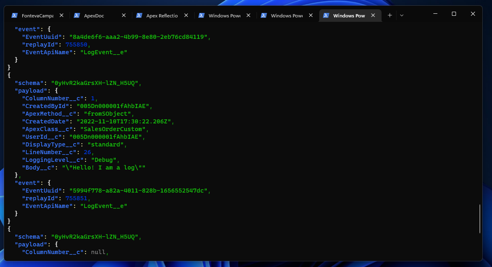
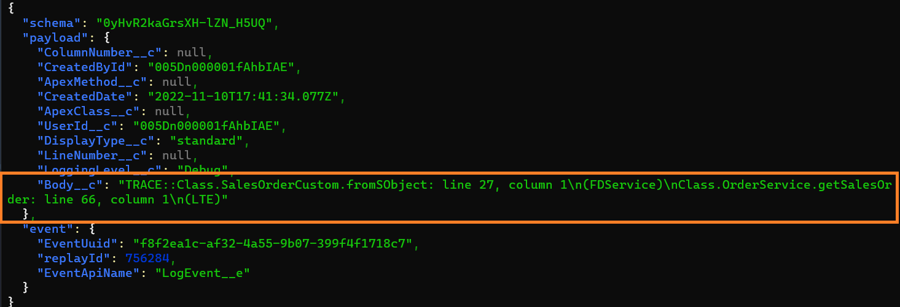

# Terminal Logger

Allows you to debug code directly on your terminal.

## Example

Calling `Logger.debug('Hello! I am a log');` will result in the following on your terminal.



## Setup

1. Copy/deploy the contents of this code into the desired org
2. Add `Logger.debug` calls wherever you want to debug code
3. In your terminal, subscribe to `LogEvent__e` platform events (read below how to do this)
4. Use Salesforce to perform the operations that will call your code, the same way as you would when using `System.debug` calls.
5. Keep an eye on your terminal to see your logs.

### Listening to platform events

Calls to the `Logger` class will be emitted through platform events, using a custom
event object called `LogEvent__e`. You can listen to these events however you want, but to
use your terminal you can do the following:

* Install the `shane-sfdx-plugins` SFDX plugin: https://github.com/mshanemc/shane-sfdx-plugins
* Run `sfdx streaming:subscribe -n 'LogEvent__e'`

This will start listening for any new events, and print to the terminal whatever it receives.

Note: One limitation is that this operation will eventually time-out, so you will need to run it once again
to subscribe one more time to the event.

## Logging the Stack Trace

Besides simple debugs, it is also very helpful to see the entire stack trace of a call, to understand
the entire flow of where the code is being called from.

To log a stack trace call

```java
Logger.trace();
```

This will output something like 


